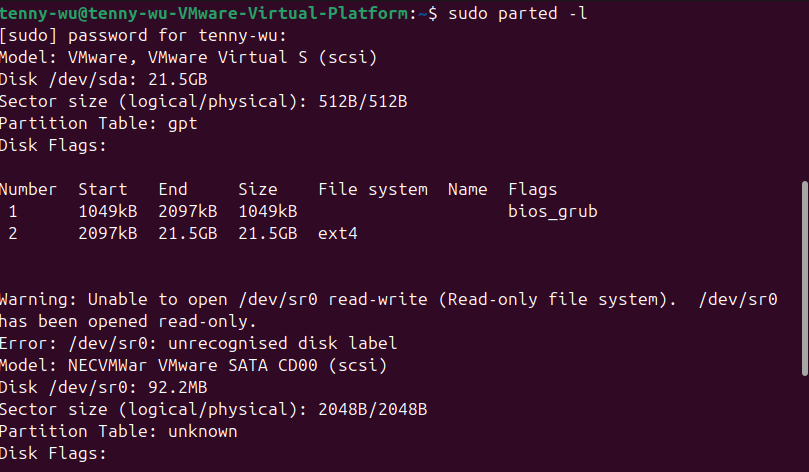

# Linux Filesystem, Permissions & Memory Management

Linux coursework inspecting GPT partitions, inode and link behavior, permissions, and C memory issues using GDB and compiler diagnostics.

**Author:** [Tenny Wu](https://github.com/714tenny)  
**Project type:** Academic lab / historical case study  
**Status:** Source work documented; scope and validation limits recorded below

## Context

Completed academic Lab 02 submission. Published evidence supports filesystem and debugging exercises; it does not demonstrate a complete memory-safety remediation test.

## Tools

Ubuntu Linux, GNU Parted, ls, ln, chmod, GCC, GDB, C

## Key results

- Inspected a GPT-partitioned VMware disk with a BIOS boot partition and ext4 partition.
- Created symbolic and hard links and inspected inode/permission behavior.
- Used GDB and compiler output to examine uninitialized values and allocation-related issues.
- Identified why a successful run alone cannot establish that memory leaks and out-of-bounds access are fixed.

## Documentation

- [Investigation notes](docs/investigation.md)
- [Sources and screenshot index](docs/source-and-evidence.md)
- [Commands](docs/commands.md)

## Evidence preview

See the [evidence index](docs/source-and-evidence.md) for source-page references and the limits of each observation.

## Skills demonstrated

Linux disk inspection, inodes, links, permissions, C debugging, compiler diagnostics, memory-safety reasoning.

## Evidence boundaries

This repository presents authorized coursework and its recorded evidence. It does not represent a live production incident, newly validated remediation, or a deployed security product. Conclusions, uncertainties, and source discrepancies are documented in the investigation notes.
